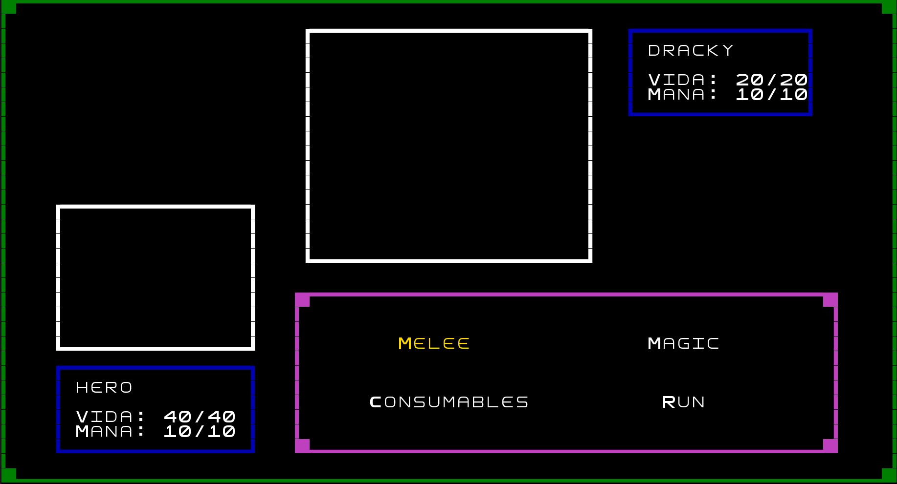
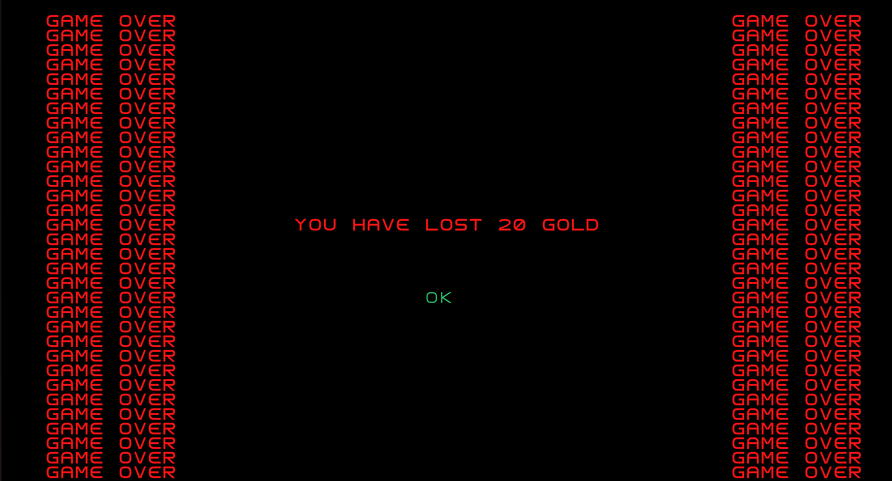

## LDTS_T02_GR04 - Final Quest

    Um jogo de RPG e aventura altamente inspirado em entradas como Dragon Quest e Final Fantasy.

    O protagonista, um nobre guerreiro, tem que avançar incessantemente através de um castelo repleto de monstros, items e segredos.
    
    Poderá interagir com pessoas e vencer várias lutas para se tornar mais forte e derrotar o temido MacGuffin no topo do castelo.

O jogo consta de um mapa aberto ao jogador 100% do tempo, tendo este completo controlo do que decide fazer, seja lutar explorar ou interagir com coisas. Existe alguns NPC's, ou Non Player Characters, com que o player poderá interagir para descobrir mais sobre os residentes da vila entre outras coisas.

Dentro do castelo, o jogador poderá andar livremente pelas salas porém, a cada passo que dá existirá uma chance de este entrar em combate com um inimigo aleatório atribuído ao andar em que se encontra. Terá de continuar a derrotar monstros e subindo no castelo pelas escadas espalhadas pelos vários andares para continuar a subir até eventualmente chegar a um boss final. Poderá também encontrar baús dentro do castelo que terão dentro deles items completamente aleatórios.

Como é entendido pelo conceito de baús, existem diversos items implementados no jogo, quer sejam items permanentes como armaduras equipáveis pelo herói ou items consumíveis como poções de cura ou de dano que fazem inimigos perder vida. Estes serão guardados no inventário infinito do herói.

O jogador terá acesso à informação dos atributos do seu herói a qualquer momento, assim como a escolha de aumentar um deles após subir de nível com o sistema de experiência implementado.

Na eventualidade do herói morrer, o jogador será retornado à vila, perdendo uma percentagem do seu dinheiro obtido ao matar inimigos.

    Desenvolvido por Vasco Melo (up202207564@fe.up.pt), Tiago Pinheiro (up202207890@fe.up.pt) e Tiago Rocha (up202206232@fe.up.pt) para LDTS 2023⁄2024.

