## LDTS_T02_GR04 - Final Quest

Um jogo de RPG e aventura altamente inspirado em entradas como Dragon Quest e Final Fantasy.

O protagonista, um nobre guerreiro, tem que avançar incessantemente através de um castelo cujo layout é gerado aleatóriamente, repleto de monstros, items e segredos.
Poderá interagir com pessoas, completar missões e vencer várias lutas para se tornar mais forte e derrotar o temido MacGuffin no topo do castelo.

Desenvolvido por *Vasco Melo* (up202207564@fe.up.pt), *Tiago Pinheiro* (up202207890@fe.up.pt) e
*Tiago Rocha* (up202206232@fe.up.pt) para LDTS 2023⁄2024.

## Table of Contents

* [Planned Features](#implemented-features)
    * [Menu inicial](#menu-inicial)
    * [Mundo](#mundo)
        * [Vila](#vila)
        * [Floresta](#floresta)
        * [Castelo](#castelo)
            * [Exploração do castelo](#exploração-do-castelo)
    * [Herói](#herói)
        * [Inventário](#inventário)
            * [Itens](#itens)
                * [Permanentes](#permanentes)
                * [Consumíveis](#consumíveis)
        * [Atributos](#atributos)
            * [Vida](#vida)
            * [Mana](#mana)
            * [Força](#força)
            * [Inteligência](#inteligência)
            * [Velocidade](#velocidade)
        * [Classes](#classes)
            * [Guerreiro](#guerreiro)
            * [Mago](#mago)
        * [Salvar o jogo](#salvar-o-jogo)
    * [Combate](#combate)
        * [Sistema de combate](#sistema-de-combate)
            * [Turnos](#turnos)
                * [Ataques](#ataques)
                * [Usar itens](#usar-itens)
                * [Fugir](#fugir)
        * [Inimigos](#inimigos)
            * [Boss](#boss)
        * [Experiência](#experiência)
        * [Morte](#morte)
    * [Funcionalidades técnicas](#funcionalidades-técnicas)
        * [Implementação de imagens](#implementação-de-imagens)
        * [Música](#música)

* [Design](#design)
    * [Padrão de arquitetura](#padrão-de-arquitetura)
        * [Problem in context](#problem-in-context)
        * [The Pattern](#the-pattern)
        * [Implementation](#implementation)
        * [Consequences](#consequences)
    * [Input](#input)
        * [Problem in context](#problem-in-context-1)
        * [The Pattern](#the-pattern-1)
        * [Implementation](#implementation-1)
        * [Consequences](#consequences-1)
    * [Estado de save](#estado-de-save)
        * [Problem in context](#problem-in-context-2)
        * [The Pattern](#the-pattern-2)
        * [Implementation](#implementation-2)
        * [Consequences](#consequences-2)
    * [Estado de jogo](#estado-do-jogo)
        * [Problem in context](#problem-in-context-3)
        * [The Pattern](#the-pattern-3)
        * [Implementation](#implementation-3)
        * [Consequences](#consequences-3)
    * [Música](#música)
        * [Problem in context](#problem-in-context-4)
        * [The Pattern](#the-pattern-4)
        * [Implementation](#implementation-4)
        * [Consequences](#consequences-4)
    * [Gráficos](#gráficos)
        * [Problem in context](#problem-in-context-5)
        * [The Pattern](#the-pattern-5)
        * [Implementation](#implementation-5)
        * [Consequences](#consequences-5)
    * [PNGToPixels](#pngtopixels)
        * [Problem in context](#problem-in-context-6)
        * [The Pattern](#the-pattern-6)
        * [Implementation](#implementation-6)
        * [Consequences](#consequences-6)
    * [Criação de monstros e elementos](#criação-de-monstros-e-elementos)
        * [Problem in context](#problem-in-context-7)
        * [The Pattern](#the-pattern-7)
        * [Implementation](#implementation-7)
        * [Consequences](#consequences-7)
    * [Variantes de monstros](#variantes-de-monstros)
        * [Problem in context](#problem-in-context-8)
        * [The Pattern](#the-pattern-8)
        * [Implementation](#implementation-8)
        * [Consequences](#consequences-8)
    * [Comportamento dos monstros](#comportamento-dos-monstros)
        * [Problem in context](#problem-in-context-9)
        * [The Pattern](#the-pattern-9)
        * [Implementation](#implementation-9)
        * [Consequences](#consequences-9)
    * [Inimigo "Boss"](#inimigo-boss)
        * [Problem in context](#problem-in-context-10)
        * [The Pattern](#the-pattern-10)
        * [Implementation](#implementation-10)
        * [Consequences](#consequences-10)

* [UML](#uml)

* [Testing](#testing)

* [Self-Evaluation](#self-evaluation)

## PLANNED FEATURES

### *Menu inicial*

    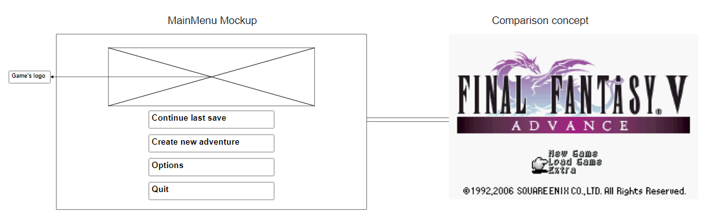

### *Mundo*
 
Ao começar um novo jogo, o [herói](#herói) aparecerá no começo de um caminho de terra, dentro de uma [floresta](#floresta) densa, que levará até à [vila](#vila) que contém o [castelo](#castelo) do seu inimigo e algumas pessoas com que puderá interagir.

    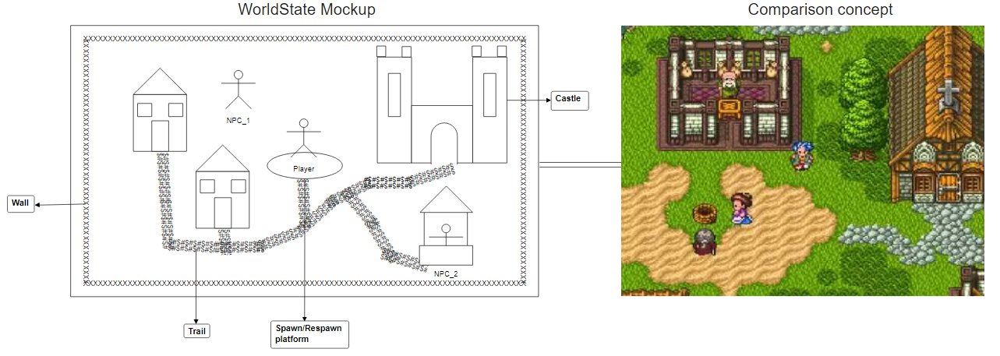
    

- ### Vila 
    Composta de algumas casas e local de origem de várias pessoas residentes que poderão oferecer alguns `serviços` ao jogador, como venda e compra de [itens](#itens) usando [dinheiro](#inimigos), dar missões ao [herói](#herói), oferecer uma cura completa da [vida](#vida), etc.

    

    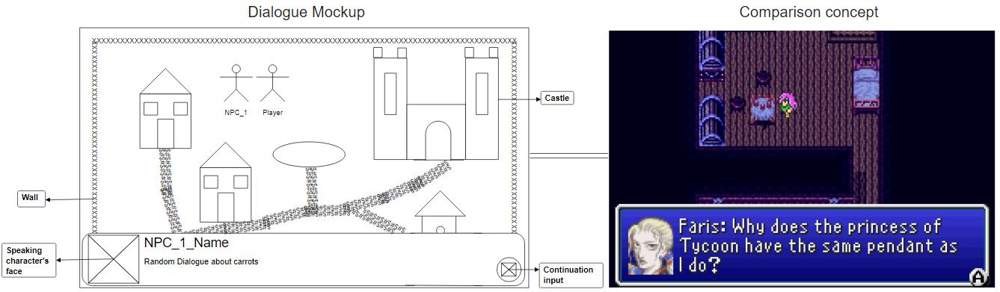
    

- ### Floresta 
    Ao longo da travessia do caminho da floresta, o jogador será explicado acerca de algumas mecânicas e modos de funcionamento do jogo através de pequenas lutas de `tutorial` ou alguns textos apresentados. Uma vez completa a caminhada, o [herói](#herói) entrará na [vila](#vila) sem conseguir voltar à floresta nessa aventura. No caso de recomeço de aventura, será apresentado ao jogador a escolha de `passar à frente` esse tutorial e ir direto para a [vila](#vila).

- ### Castelo 
    O castelo será o local principal da aventura do [herói](#herói), tendo o seu layout alterado e recriado de forma `aleatória` cada vez que o jogador [morre](#morte) ou começa uma aventura nova, contendo [inimigos](#inimigos) que poderão [atacar](#ataques) o jogador. Terá um certo número de andares até o jogador chegar ao piso final com o chefe do castelo e vilão da história.

    - ### Exploração do castelo 
        Cada vez que o jogador da um passo dentro do castelo, existirá uma chance de se deparar com um [inimigo](#inimigos) e entrar em [combate](#combate), havendo ainda outra pequena chance desse [inimigo](#inimigos) ser uma versão mais forte dos restantes monstros, com os seus [atributos](#atributos) melhorados. 
 Uma vez derrotado o monstro existirá um `período de graça` em que o jogador poderá andar livremente sem ter chances de entrar noutra luta de aproximadamente `20 passos`, ao que no final voltará a entrar em vigor o sistema normal.

### *Herói*
O jogador terá acesso a um menu onde poderá abrir o seu [inventário](#inventário), verificar o seus [atributos](#atributos), o seu [equipamento](#permanentes), aceder a configurações e [salvar o seu jogo](#salvar-o-jogo).

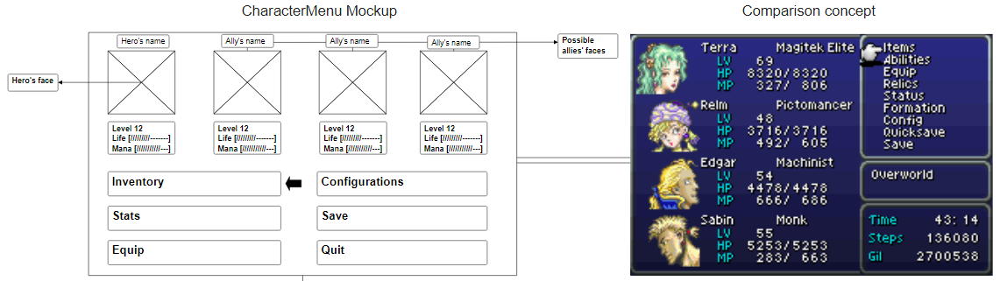

- ### Inventário 
    Um número `ilimitado` de espaços necessários para guardar [itens](#itens).

    

    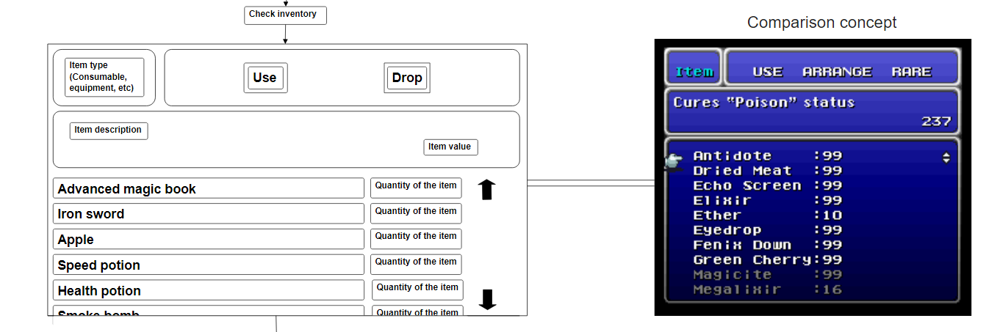
    

    - ### Itens 
        Podem ser [permanentes](#permanentes) como peças de equipamento ou [consumíveis](#consumíveis) como poções e comida. Podem ser vendidos num [vendedor](#vila) assim como comprados, usando [dinheiro](#inimigos) obtido em lutas.

        - ### Permanentes 
            Coisas como, por exemplo, armaduras ou armas ofensivas. Poderá ser usado equipamento defensivo na cabeça, tronco e pernas, assim como um máximo de uma arma apenas, como uma espada ou livro de feitiços.

        - ### Consumíveis 
            Alguns itens como poções, comida, objetos arremessáveis, etc, serão gastos e eliminados do inventário do jogador após o seu uso.
        

- ### Atributos 
    O jogador terá uma lista dos seus atributos como [vida](#vida), [mana](#mana), [força](#força), [inteligência](#inteligência) e [velocidade](#velocidade). Cada atributo terá um valor que é usado em diferentes pontos e situações relativas ao atributo.

    

    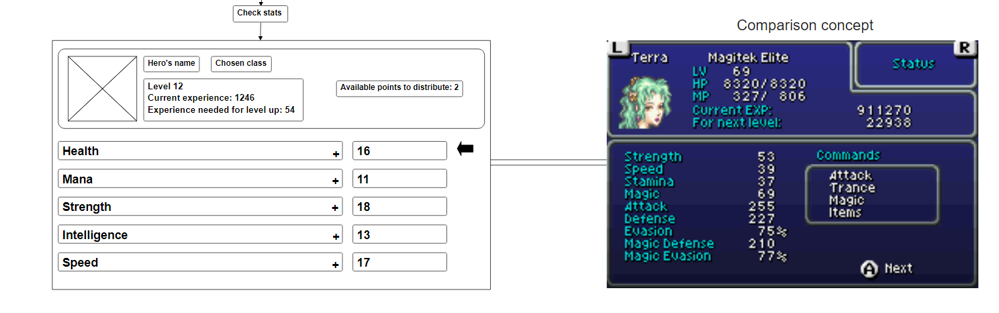
    

    - ### Vida 
        Afeta a quantidade de dano que o [herói](#herói) consegue receber sem [morrer](#morte).

    - ### Mana 
        Afeta a quantidade de recursos disponível necessária para lançar feitiços.

    - ### Força 
        Afeta o dano causado por [ataques](#ataques) físicos contra [inimigos](#inimigos) e a possibilidade de conseguir fazer certas ações. Pode ter um requerimento mínimo para que se consiga usar uma certa arma.

    - ### Inteligência 
        Afeta o dano causado por [ataques](#ataques) mágicos contra [inimigos](#inimigos). Pode ter um requerimento mínimo para que se consiga usar uma certa arma.

    - ### Velocidade 
        Afeta a ordem de [ataque](#ataques) dos elementos envolvidos numa luta e a probabilidade de sucesso de uma tentativa de [fuga](#fugir).

- ### Classes 
    O jogo terá `duas classes` ([guerreiro](#guerreiro) e [mago](#mago)), disponíveis para escolha no início da aventura. Cada uma começa com uma arma e [atributos](#atributos) iniciais específicos.

    - ### Guerreiro 
        Esta classe começará com uma `espada` e um foco dos seus atributos na [força](#força) e [vida](#vida).

    - ### Mago 
        Esta classe começará com um `livro de magia` inicial bastante limitado e um foco dos seus atributos na [inteligência](#inteligência) e [mana](#mana);
- ### Salvar o jogo
    O jogador, durante a sua partida na [vila](#vila) ou no [castelo](#castelo), poderá sempre salvar o estado do jogo atual com o intuito de não perder o seu progresso.

### *Combate*

- ### Sistema de combate 
    O jogo usará um sistema de `combate sequencial por turnos`, ou seja, cada elemento da luta, seja [monstro](#inimigos) ou o próprio [herói](#herói), terá de esperar pela sua vez de realizar uma ação, como [atacar](#ataques), [usar um item](#usar-itens) ou [fugir](#fugir).

    

    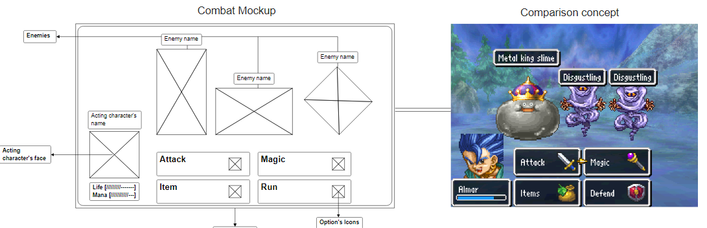
    

    - ### Turnos 
        Cada turno será organizado tendo em conta a [velocidade](#velocidade) de cada entidade da luta (através de uma `queue`). Um turno consiste em `uma ação` apenas.

        - ### Ataques 
            Cada [inimigo](#inimigos) assim como o próprio [herói](#herói) terão ataques específicos, relativos ao seu tipo no caso de [inimigos](#inimigos) e à arma equipada no caso do [herói](#herói). Cada um terá mais do que 1 opção de escolha pra ataques, podendo alguns ter `efeitos` de condições diferentes. Estes ataques terão em conta o atributo relevante ([força](#força) para ataques físicos e [inteligência](#inteligência) para ataques mágicos), assim como uma `percentagem de acerto`.

        - ### Usar itens 
            O jogador tem a opção de usar um item, por exemplo, para se curar. Fazê-lo gasta também o [turno](#turnos) atual do [herói](#herói).

            

            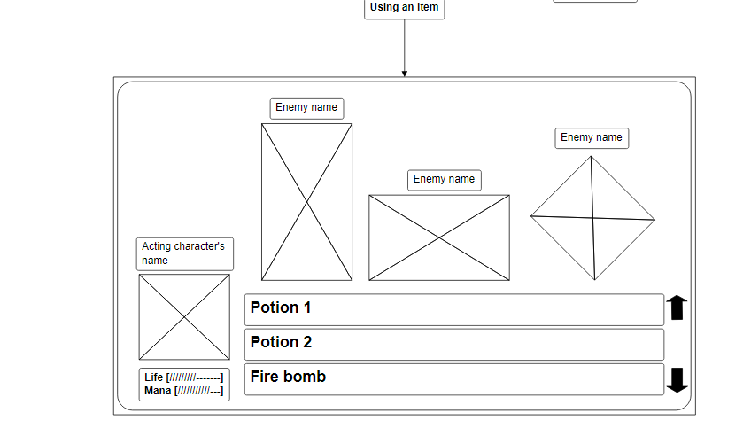
            

        - ### Fugir 
            O jogador tem também a opção de tentar fugir, ao que será decidido o sucesso dependendo do [atributo](#atributos) de [velocidade](#velocidade) comparado ao do inimigo e o seu nível em relação com o do [herói](#herói). No caso de não ser bem sucedido em fugir este perderá o seu [turno](#turnos) atual.

- ### Inimigos 
    Assim como o jogador, estes têm os seus próprios valores de [atributos](#atributos) e diferentes [ataques](#ataques) que funcionam da mesma forma que os do [herói](#herói). Também existirão diferentes comportamentos entre os monstros, como maior agressividade ou mais cobarde. Ao serem derrotados, darão [experiência](#experiência) e dinheiro, tendo também uma chance de recompensar o jogador com vários [itens](#itens) de raridades e tipos diferentes.
    
    - ### Boss
        No final do jogo , existirá um [inimigo](#inimigos) único que servirá como obstáculo final. Este inimigo terá uma mecânica única que consiste em variações do mesmo [inimigo](#inimigos) em diferentes campanhas ao castelo. Sempre que se inicia um novo jogo, o boss será diferente à da última passagem do castelo.

- ### Experiência 
    Após ganhar uma luta, o [herói](#herói) será recompensado com uma certa quantidade de experiência dependendo do número de [inimigos](#inimigos) derrotados e os seus níveis. Chegando a um patamar específico, `subirá de nivel` e ganhará 1 ponto que pode usar para aumentar um dos seus [atributos](#atributos) em 1.

- ### Morte 
    Na eventualidade do jogador perder toda a sua [vida](#vida) e morrer, o [herói](#herói) renascerá, retornando ao centro da [vila](#vila). Manterá o seu [nível](#experiência), [atributos](#atributos) e [classe](#classes) porém `perdendo uma percentagem do seu` [dinheiro](#inimigos). 
 O layout do [castelo](#castelo) será então `novamente gerado` de forma aleatória.

    

    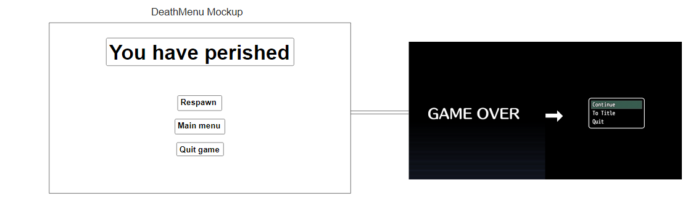
    

### *Funcionalidades técnicas*

- ### Implementação de imagens
    Uso de `imagens coloridas` nos vários elementos do jogo como no menu, cenários, inimigos, [herói](#herói), etc.

- ### Música
    Adição de `música ambiente` e/ou de `combate`.

## DESIGN

### *Padrão de arquitetura*

#### Problem in context

A arquitetura de um jogo é um dos fatores mais importantes para a criação do mesmo, uma vez que uma estrutura mal implementada poderá causar vários problemas no futuro do desenvolvimento. Para tal, foi selecionado um design pattern com o propósito de resolver tal problema.

#### The Pattern

Usámos o **MVC Pattern**, ou **Model-View-Controller**, com a seguinte distribuição:

- **Model** - Guarda a informação acerca da estrutura dos dados do [herói](#herói) e [inimigos](#inimigos) e os seus [estados](#estado-de-jogo).
- **View** - Gere as interações com o jogador tanto [inputs](#input) como outputs.
- **Controller** - Processa todas as mudanças que acontecerão.

#### Implementation

`[--------------------------------------------------------------------------------------------------------]`

#### Consequences

- Facilidade na modificação das estruturas
- Aumento de coerência
- Melhor testabilidade

### *Input*

#### Problem in context

Dependendo do [estado atual do jogo](#estado-de-jogo) e dos inputs do jogador, irá levar a resultados diferentes.

#### The Pattern

Para isso implentámos o **Command Pattern**, de forma a facilitar o uso e execução de diferentes eventos usando a informação recebida como input.

#### Implementation

`[--------------------------------------------------------------------------------------------------------]`

#### Consequences

- Maior facilidade a adicionar novas opções e ações de forma abstrata

### *Estado de save*

#### Problem in context

O jogo incluirá uma opção de [salvar o progresso](#salvar-o-jogo) atual para a eventualidade do jogador quiser sair do jogo, evitando a perda do seu tempo.

#### The Pattern

Implementámos o **Memento Pattern**.

#### Implementation

`[--------------------------------------------------------------------------------------------------------]`

#### Consequences

- Possibilidade de [salvar o progresso](#salvar-o-jogo) de uma aventura

### *Estado de jogo*

#### Problem in context 

Sendo um jogo focado principalmente em [combate](#combate) e [exploração](#mundo), iremos ter de alterar constantemente entre esses ditos estados dependendo das ações do jogador. Desse modo, precisámos de uma maneira de verificar qual seria o estado atual e modificar as condições necessárias referentes a ele.

#### The Pattern

Para tal implementámos o **State Pattern**, que exigirá a necessidade de criar uma classe para cada estado possível de um objeto e inserir todos os comportamentos específicos nessas classes. Usamos o objeto original para guardar uma referência ao objeto que representa o estado atual e atribui todo o trabalho relacionado ao estado a esse objeto, em vez de implementarmos todos os comportamentos no objeto original. A transição entre estados ocorre pela substituição de um objeto pelo  referente ao novo estado.

#### Implementation

`[--------------------------------------------------------------------------------------------------------]`

#### Consequences

- Menor necessidade de dependência de flags
- Mais classes
- Sem if's complexos

### *Música*

#### Problem in context

Nós tinhamos o intuito de adicionar [música](#música) ambiente para quando o [herói](#herói) estivesse a explorar a [vila](#vila), por exemplo, e também música de [combate](#combate), de forma a tornar a experiência mais imersiva e apreciável, porém para isso, em vez de adicionarmos responsabilidades a mais a classes como a de [combate](#combate), pensamos numa maneira de usar uma classe independente para tratar disso.

#### The Pattern

Para isso usámos o **Observer Pattern**, de forma a que a classe responsável pela música fosse notificada sempre que o [estado do jogo](#estado-de-jogo) sofresse alterações, atualizando a classe e mudando a música para o novo estado registado.

#### Implementation

`[--------------------------------------------------------------------------------------------------------]`

#### Consequences

- Single Responsability Principle. Conseguimos evitar a adição de responsabilidades extra nas classes
- Open/Closed Principle. Poderá sempre ser criado mais observers sem modificar as classes base do jogo
- Estabelecer relações entre objetos em runtime

### *Gráficos*

#### Problem in context

Queriamos garantir que o nosso jogo fosse [colorido](#implementação-de-imagens), uma vez que incentiva a jogabilidade. Devido a limitações do lanterna, tivemos de arranjar uma forma de implementar imagens PNG para elementos como [inimigos](#inimigos) e o [herói](#herói), durante diferentes ações, e algumas em constante modificação, como barras de [vida](#vida).

#### The Pattern

Para isso usámos o **Template Pattern**, permitindo-nos gerar imagens num contexto geral, desta forma imagens mais complexas como barras de vida terão a mesma base que imagens mais simples nomeadamente sprites.

#### Implementation

`[--------------------------------------------------------------------------------------------------------]`

#### Consequences

- Maior facilidade a adicionar novas imagens ajustáveis sem repetir código
- Respeita princípios sólidos

### *PNGToPixels*

#### Problem in context

Relacionado com o problema dos [gráficos](#gráficos), precisámos de uma maneira de converter imagens PNG para uma matriz de cores hexadecimal, tendo como base as limitações do lanterna.

#### The Pattern

Para isso usámos o **Adapter Pattern**,  de forma a conseguirmos usar imagens PNG no nosso ambiente, o que de outra maneira seria incompatível.

#### Implementation

`[--------------------------------------------------------------------------------------------------------]`

#### Consequences

- Possibilidade de adição de elementos [coloridos](#implementação-de-imagens) no jogo

### *Criação de monstros e elementos*

#### Problem in context

O nosso jogo, sendo focado em [combate](#combate), oferece alguma variedade de [inimigos](#inimigos). Estes podem diferir em aspetos nomeadamente [atributos](#atributos) e até mesmo [ataques](#ataques), assim como outros elementos do jogo. Isto pode provar-se demasiado extensivo se delegarmos tudo para uma só classe.

#### The Pattern

Como solução implementámos o **Factory Pattern**, que irá organizar e ordernar as diferentes necessidades de características de um monstro, que será criado sob a forma de diferentes classes,  cuja a chamada será realizada quando for necessário.

#### Implementation

`[--------------------------------------------------------------------------------------------------------]`

#### Consequences

- Menor número de uso de condicionantes no código
- Maior eficiência na criação em massa de diferentes objetos do mesmo tipo

### *Variantes de monstros*

#### Problem in context

Da mesma forma que existe vários monstros completamente diferentes, também existe aqueles que são semelhantes a alguns na aparência e comportamentos, porém são levemente diferentes em aspetos como a sua [força](#força) ou [ataques](#ataques). Isto prova-se pouco eficiente se formos atribuir esta responsabilidade à criação de monstros já criada.

#### The Pattern

Implementámos então o **Prototype Pattern**, que com base na criação de um monstro já previamente declarado, a nova classe irá chamar esse mesmo monstro e alterar os aspetos que o diferem. Desta forma permite a criação de diferentes variantes de monstros sem ocorrer a repetição de código.

#### Implementation 

`[--------------------------------------------------------------------------------------------------------]`

#### Consequences

- Maior eficiencia na criação em massa de variantes dos vários monstros

### *Comportamento dos monstros*

#### Problem in context

Com o intuito de desenvolver um comportamento específico de um monstro e, desta forma aumentar a complexidade do [combate](#combate) pretende-se adicionar a certos monstros estratégias de ação que alteram o comportamento do mesmo durante o [combate](#combate). Por exemplo, monstros com uma estratégia agressiva darão prioridade a [atacar](#ataques) o [herói](#herói) mesmo que estejam prestes a morrer.

#### The Pattern

Para isso implementámos o **Strategy Pattern**, de forma a criar classes que irão definir a forma como um monstro irá agir em diferentes situações de [combate](#combate).

#### Implementation

`[--------------------------------------------------------------------------------------------------------]`

#### Consequences

- Meno complexidade de código central e maior eficiência
- Maior facilidade em criar diferentes comportamentos

### *Inimigo "Boss"*

#### Problem in context

Para a construção do [boss](#boss) em cada nova passagem pelo castelo, terá-se levar em conta as diferentes possibilidades do mesmo.

#### The Pattern

Implementámos o **Composite Pattern** de forma a construir o [boss](#boss) com base nas suas possibilidades de composição.

#### Implementation

`[--------------------------------------------------------------------------------------------------------]`

#### Consequences

- Possibilidade de criar um [inimigo](#inimigos) mais complexo

## UML

Para facilitar o desenvolvimento e compreensão do algoritmo do jogo, foi desenvolvido um diagrama de classes e um de estados. Estes diagramas não têm em conta todas as features esperadas na sua implementação, uma vez que não temos capacidade de prever a sua futura implementação ainda. Desta forma, está representado as principais features do jogo, sabendo que estes diagramas têm a possibilidade de sofrer alterações no futuro.

### Diagrama de classes

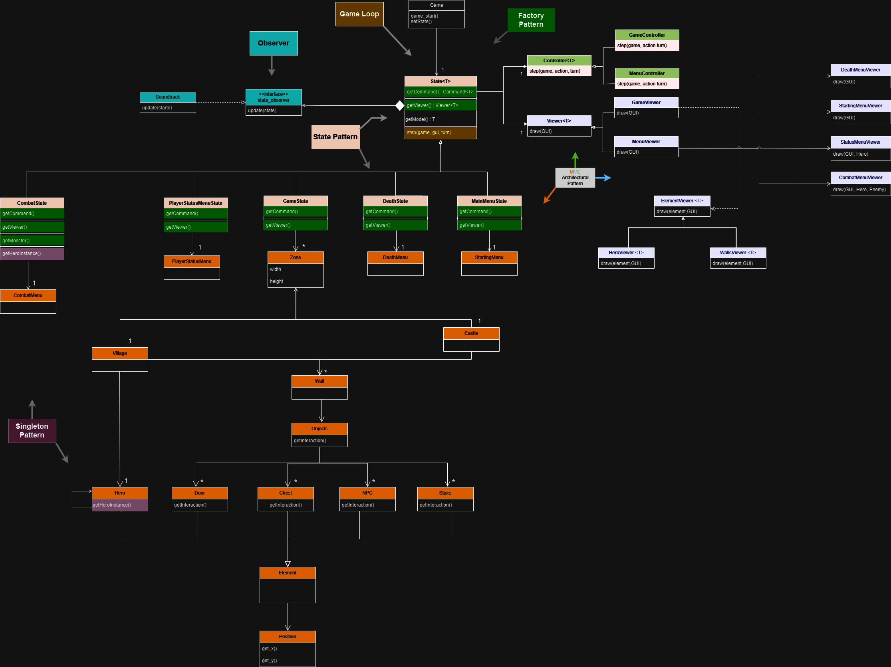

### Diagrama de estados

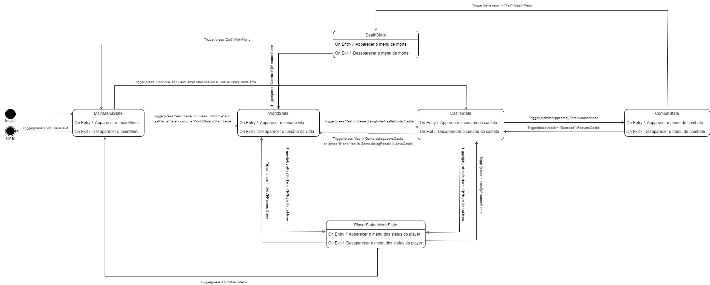

## TESTING

Ao longo da implementação do projeto irão ser desenvolvidos diferentes testes para garantir a integridade do código evitando assim a existência de bugs. Desta forma já foi desenvolvido um teste relativamente à função de colisão na pasta 'testes'.

## SELF-EVALUATION

- *Vasco Melo* - 33.3%
- *Tiago Pinheiro* - 33.3%
- *Tiago Rocha* - 33.3%