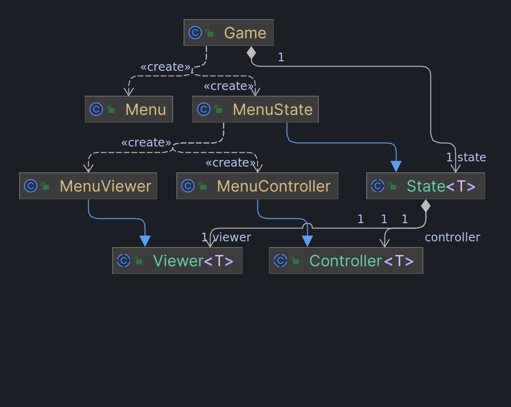
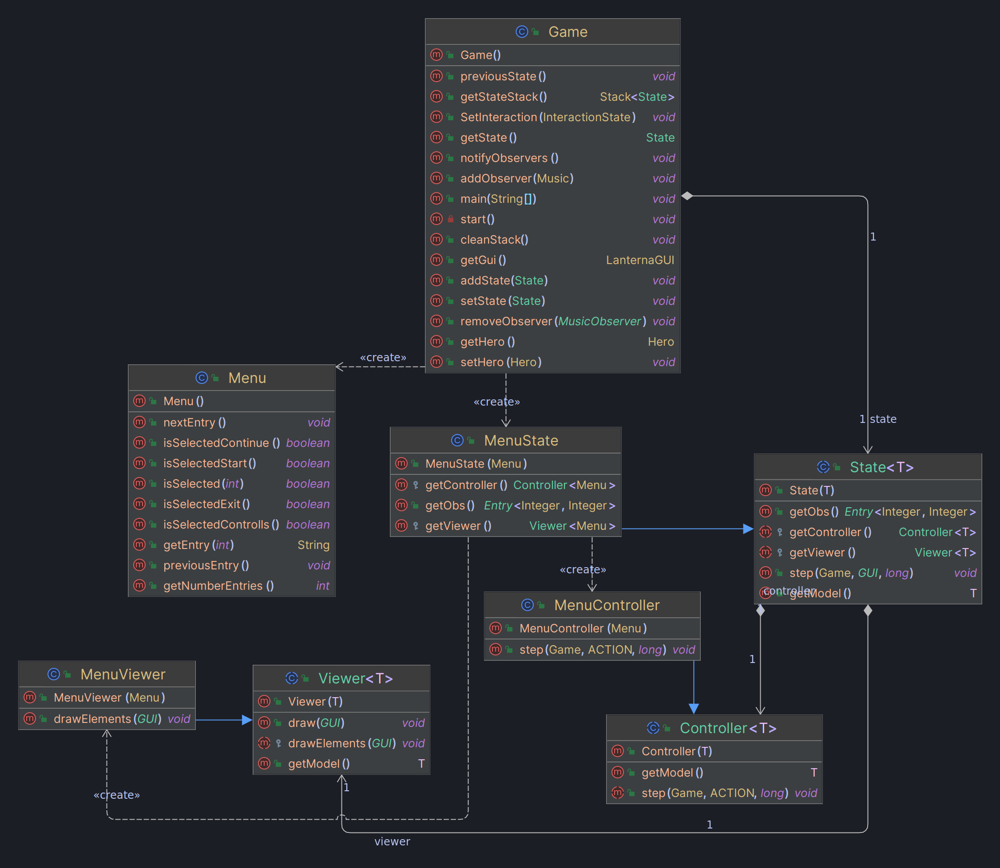
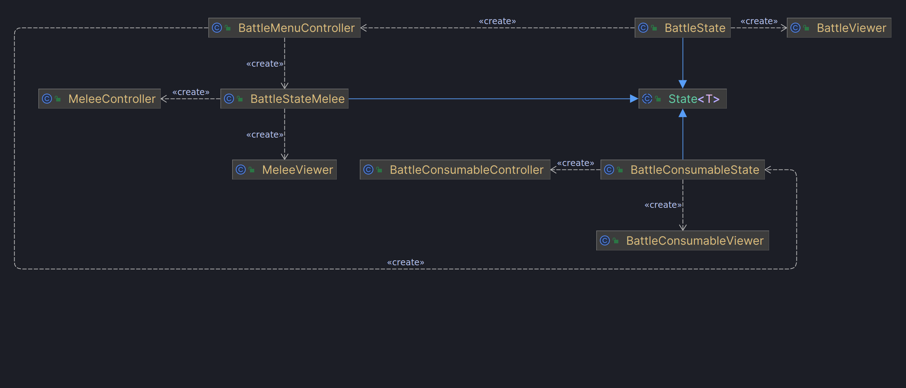
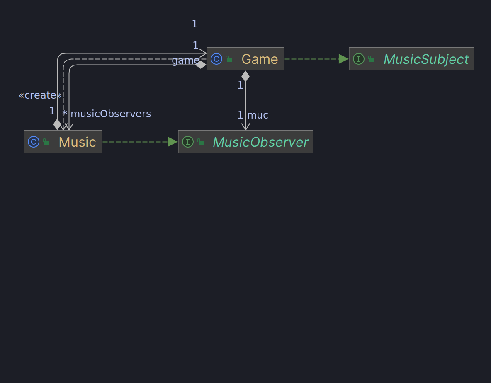
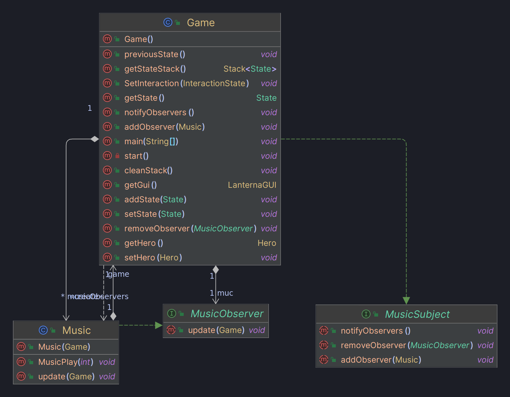
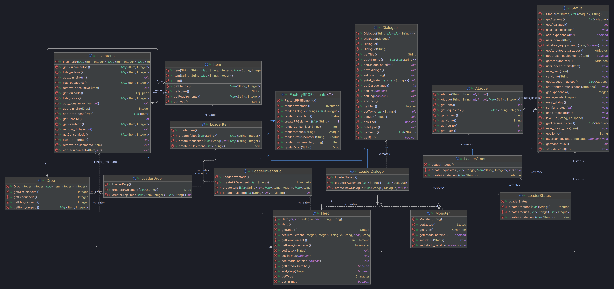
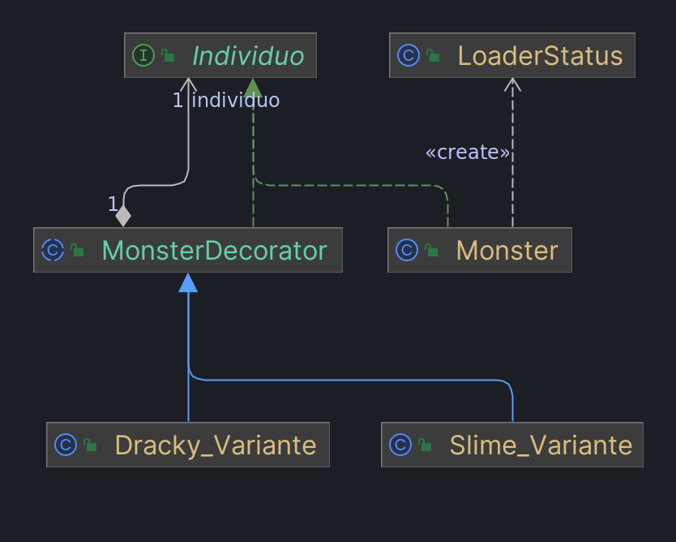
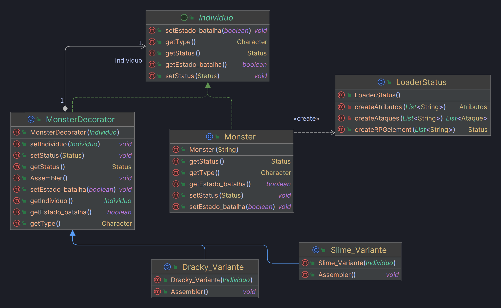
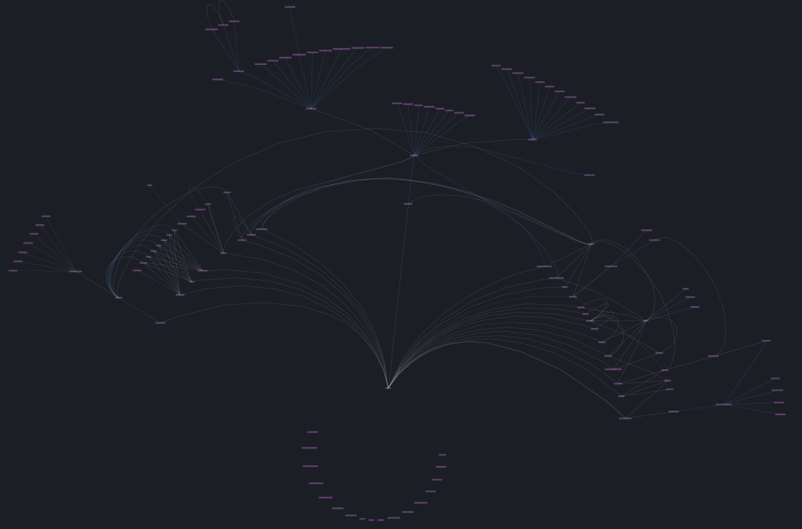
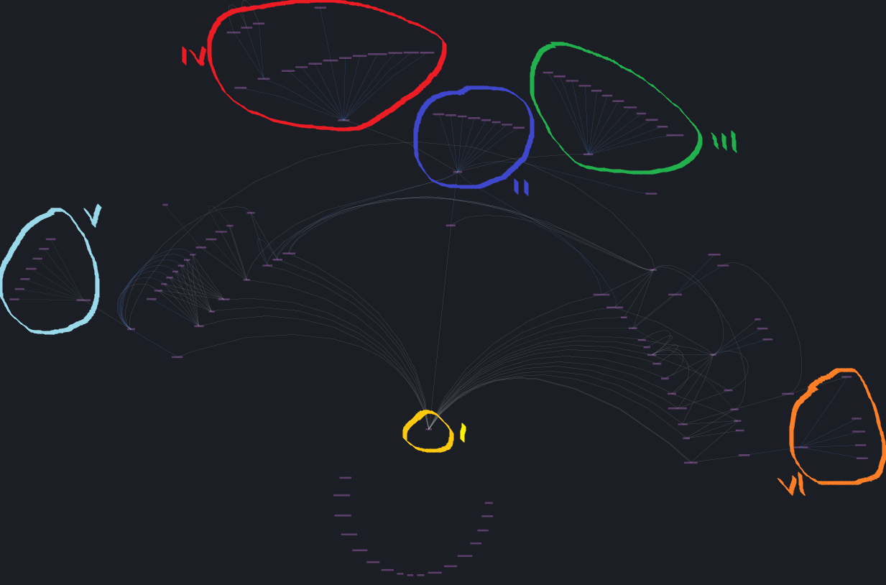

## LDTS_T02_GR04 - Final Quest

Um jogo de RPG e aventura altamente inspirado em entradas como Dragon Quest e Final Fantasy.

O protagonista, um nobre guerreiro, tem que avançar incessantemente através de um castelo cujo layout é gerado aleatóriamente, repleto de monstros, items e segredos.
Poderá interagir com pessoas, completar missões e vencer várias lutas para se tornar mais forte e derrotar o temido MacGuffin no topo do castelo.

Desenvolvido por *Vasco Melo* (up202207564@fe.up.pt), *Tiago Pinheiro* (up202207890@fe.up.pt) e
*Tiago Rocha* (up202206232@fe.up.pt) para LDTS 2023⁄2024.

## Table of Contents
* [Implemented features](#implemented-features)
    * [Menu inicial](#menu-inicial)
    * [Mundo](#mundo)
        * [Vila](#vila)
        * [Castelo](#castelo)
            * [Exploração do castelo](#exploração-do-castelo)
    * [Herói](#herói)
        * [Inventário](#inventário)
            * [Itens](#itens)
                * [Permanentes](#permanentes)
                * [Consumíveis](#consumíveis)
        * [Atributos](#atributos)
            * [Vida](#vida)
            * [Mana](#mana)
            * [Força](#força)
            * [Inteligência](#inteligência)
            * [Velocidade](#velocidade)
    * [Combate](#combate)
        * [Sistema de combate](#sistema-de-combate)
            * [Turnos](#turnos)
                * [Ataques](#ataques)
                * [Usar itens](#usar-itens)
                * [Fugir](#fugir)
        * [Inimigos](#inimigos)
        * [Experiência](#experiência)
        * [Morte](#morte)
    * [Elementos](#elementos)
        * [Interações](#interações)
    * [Música](#música)

* [Planned Features](#implemented-features)
    * [Classes](#classes)
        * [Guerreiro](#guerreiro)
        * [Mago](#mago)
    * [Salvar o jogo](#salvar-o-jogo)
    * [Boss](#boss)
    * [Funcionalidades técnicas](#funcionalidades-técnicas)
        * [Implementação de imagens](#implementação-de-imagens)

* [Design](#design)
    * [Padrão de arquitetura](#padrão-de-arquitetura)
        * [Problem in context](#problem-in-context)
        * [The Pattern](#the-pattern)
        * [Implementation](#implementation)
        * [Consequences](#consequences)
    * [Estado de jogo](#estado-do-jogo)
        * [Problem in context](#problem-in-context-1)
        * [The Pattern](#the-pattern-1)
        * [Implementation](#implementation-1)
        * [Consequences](#consequences-1)
    * [Música](#música)
        * [Problem in context](#problem-in-context-2)
        * [The Pattern](#the-pattern-2)
        * [Implementation](#implementation-2)
        * [Consequences](#consequences-2)
    * [Implementação do Hero](#implementação-do-hero)
        * [Problem in context](#problem-in-context-3)
        * [The Pattern](#the-pattern-3)
        * [Implementation](#implementation-3)
        * [Consequences](#consequences-3)
    * [Criação de monstros e elementos](#criação-de-monstros-e-elementos)
        * [Problem in context](#problem-in-context-4)
        * [The Pattern](#the-pattern-4)
        * [Implementation](#implementation-4)
        * [Consequences](#consequences-4)
    * [Variantes de monstros](#variantes-de-monstros)
        * [Problem in context](#problem-in-context-5)
        * [The Pattern](#the-pattern-5)
        * [Implementation](#implementation-5)
        * [Consequences](#consequences-5)

* [UML](#uml)

* [Testing](#testing)

* [Self-Evaluation](#self-evaluation)

## IMPLEMENTED FEATURES

### *Menu inicial*

    

### *Mundo*
 
Quando o jogo começa o [herói](#herói) aparece numa localização específica da [vila](#vila) (spawn), nela encontra-se um caminho de pedras que levará à zona do c[castelo](#castelo). Quando o [herói](#herói) se encontra no cenário "Mundo", o jogador tem controlo do personagem nas `quatro direções`.
    

    
    

- ### Vila 
    Composta de algumas casas e [elementos](#elementos) (árvores, paredes, etc) o jogador poderá explorar este cenário livremente. É também neste cenário que se encontram NPC's.  

- ### Castelo 
    O castelo será o local principal da aventura do [herói](#herói), contendo [inimigos](#inimigos) que poderão [atacar](#ataques) o jogador. Terá um certo número de andares até o jogador chegar ao piso final com o chefe do castelo e vilão da história.

    - ### Exploração do castelo 
        Cada vez que o jogador dá um passo dentro do castelo, existirá uma chance de se deparar com um [inimigo](#inimigos) e entrar em [combate](#combate), havendo ainda outra pequena chance desse [inimigo](#inimigos) ser uma versão mais forte dos restantes monstros, com os seus [atributos](#atributos) melhorados. 
 Uma vez derrotado o monstro existirá um `período de graça` em que o jogador poderá andar livremente sem ter chances de entrar noutra luta de aproximadamente `20 passos`, ao que no final voltará a entrar em vigor o sistema normal.

### *Herói*
O jogador terá acesso a um menu onde poderá abrir o seu [inventário](#inventário), verificar o seus [atributos](#atributos), o seu [equipamento](#permanentes).

- ### Inventário 
    Um número `ilimitado` de espaços necessários para guardar [itens](#itens).

    

    
    

    - ### Itens 
        Podem ser [permanentes](#permanentes) como peças de equipamento ou [consumíveis](#consumíveis) como poções e comida. Podem ser vendidos num [vendedor](#vila) assim como comprados, usando [dinheiro](#inimigos) obtido em lutas.

        - ### Permanentes 
            Coisas como, por exemplo, armaduras ou armas ofensivas. Poderá ser usado equipamento defensivo na cabeça, tronco e pernas, assim como um máximo de uma arma apenas, como uma espada ou livro de feitiços.

        - ### Consumíveis 
            Alguns itens como poções, comida, objetos arremessáveis, etc, serão gastos e eliminados do inventário do jogador após o seu uso.
        

- ### Atributos 
    O jogador terá uma lista dos seus atributos como [vida](#vida), [mana](#mana), [força](#força), [inteligência](#inteligência) e [velocidade](#velocidade). Cada atributo terá um valor que é usado em diferentes pontos e situações relativas ao atributo.

    

    
    

    - ### Vida 
        Afeta a quantidade de dano que o [herói](#herói) consegue receber sem [morrer](#morte).

    - ### Mana 
        Afeta a quantidade de recursos disponível necessária para lançar feitiços.

    - ### Força 
        Afeta o dano causado por [ataques](#ataques) físicos contra [inimigos](#inimigos) e a possibilidade de conseguir fazer certas ações. Pode ter um requerimento mínimo para que se consiga usar uma certa arma.

    - ### Inteligência 
        Afeta o dano causado por [ataques](#ataques) mágicos contra [inimigos](#inimigos). Pode ter um requerimento mínimo para que se consiga usar uma certa arma.

    - ### Velocidade 
        Afeta a ordem de [ataque](#ataques) dos elementos envolvidos numa luta e a probabilidade de sucesso de uma tentativa de [fuga](#fugir).

        ### *Combate*

- ### Sistema de combate 
    O jogo usará um sistema de `combate sequencial por turnos`, ou seja, cada elemento da luta, seja [monstro](#inimigos) ou o próprio [herói](#herói), terá de esperar pela sua vez de realizar uma ação, como [atacar](#ataques), [usar um item](#usar-itens) ou [fugir](#fugir).

    

    
    

    - ### Turnos 
        Cada turno será organizado tendo em conta a [velocidade](#velocidade) de cada entidade da luta (através de uma `queue`). Um turno consiste em `uma ação` apenas.

        - ### Ataques 
            Cada [inimigo](#inimigos) assim como o próprio [herói](#herói) terão ataques específicos, relativos ao seu tipo no caso de [inimigos](#inimigos) e à arma equipada no caso do [herói](#herói). Cada um terá mais do que 1 opção de escolha pra ataques, podendo alguns ter `efeitos` de condições diferentes. Estes ataques terão em conta o atributo relevante ([força](#força) para ataques físicos e [inteligência](#inteligência) para ataques mágicos), assim como uma `percentagem de acerto`.

        - ### Usar itens 
            O jogador tem a opção de usar um item, por exemplo, para se curar. Fazê-lo gasta também o [turno](#turnos) atual do [herói](#herói).

            

            
            

        - ### Fugir 
            O jogador tem também a opção de tentar fugir, ao que será decidido o sucesso dependendo do [atributo](#atributos) de [velocidade](#velocidade) comparado ao do inimigo e o seu nível em relação com o do [herói](#herói). No caso de não ser bem sucedido em fugir este perderá o seu [turno](#turnos) atual.

    - ### Inimigos 
    Assim como o jogador, estes têm os seus próprios valores de [atributos](#atributos) e diferentes [ataques](#ataques) que funcionam da mesma forma que os do [herói](#herói). Também existirão diferentes comportamentos entre os monstros, como maior agressividade ou mais cobarde. Ao serem derrotados, darão [experiência](#experiência) e dinheiro, tendo também uma chance de recompensar o jogador com vários [itens](#itens) de raridades e tipos diferentes.

    - ### Experiência 
    Após ganhar uma luta, o [herói](#herói) será recompensado com uma certa quantidade de experiência dependendo do número de [inimigos](#inimigos) derrotados e os seus níveis. Chegando a um patamar específico, `subirá de nivel` e ganhará 1 ponto que pode usar para aumentar um dos seus [atributos](#atributos) em 1.

- ### Morte 
    Na eventualidade do jogador perder toda a sua [vida](#vida) e morrer, o [herói](#herói) renascerá, retornando ao centro da [vila](#vila). Manterá o seu [nível](#experiência), [atributos](#atributos) e [classe](#classes) porém `perdendo uma percentagem do seu` [dinheiro](#inimigos). 
 O layout do [castelo](#castelo) será então `novamente gerado` de forma aleatória.

    

    
    

- ### Elementos
    Os elementos são objetos presentes no cenário que podem ter diferentes formas, cores, etc. Estes são utilizados com intuito de aumentar a imersão do jogador. Os objetos podem ter hitbox ou até mesmo interações com o jogador.
    - ### Interações
        Várias elementos poderão fornecer interações (diálogos) com o jogador, em que estas poderão ser do tipo:    
 `Avançar` - Neste tipo de interação o jogador poderá unicamente avançar o diálogo;   
        
        

        
        

        

        
        

        
        `Seleção simples` - Neste tipo de interação o jogador poderá unicamente escolher entre duas ou mais opções, cuja seleção levará a diferentes resultados.

        

        
        

- ### Música
    Adição de `música ambiente` e/ou de `combate`.

## PLANNED FEATURES

- ### Classes 
    O jogo terá `duas classes` ([guerreiro](#guerreiro) e [mago](#mago)), disponíveis para escolha no início da aventura. Cada uma começa com uma arma e [atributos](#atributos) iniciais específicos.

    - ### Guerreiro 
        Esta classe começará com uma `espada` e um foco dos seus atributos na [força](#força) e [vida](#vida).

    - ### Mago 
        Esta classe começará com um `livro de magia` inicial bastante limitado e um foco dos seus atributos na [inteligência](#inteligência) e [mana](#mana);
- ### Salvar o jogo
    O jogador, durante a sua partida na [vila](#vila) ou no [castelo](#castelo), poderá sempre salvar o estado do jogo atual com o intuito de não perder o seu progresso.

    
- ### Boss
    No final do jogo , existirá um [inimigo](#inimigos) único que servirá como obstáculo final. Este inimigo terá uma mecânica única que consiste em variações do mesmo [inimigo](#inimigos) em diferentes campanhas ao castelo. Sempre que se inicia um novo jogo, o boss será diferente à da última passagem do castelo.

### *Funcionalidades técnicas*

- ### Implementação de imagens
    Uso de `imagens coloridas` nos vários elementos do jogo como no menu, cenários, inimigos, [herói](#herói), etc.

## DESIGN

### *Padrão de arquitetura*

#### Problem in context

A arquitetura de um jogo é um dos fatores mais importantes para a criação do mesmo, uma vez que uma estrutura mal implementada poderá causar vários problemas no futuro do desenvolvimento. Para tal, foi selecionado um design pattern com o propósito de resolver tal problema.

#### The Pattern

Usámos o **MVC Pattern**, ou **Model-View-Controller**, com a seguinte distribuição:

- **Model** - Guarda a informação acerca da estrutura dos dados do [herói](#herói) e [inimigos](#inimigos) e os seus [estados](#estado-de-jogo).
- **View** - Gere as interações com o jogador tanto [inputs](#input) como outputs.
- **Controller** - Processa todas as mudanças que acontecerão.

#### Implementation

Em cada cenário do jogo existe um modelo (model). Cada modelo apresenta características próprias, portanto o comportamento da apresentação gráfica (viewer) no lanterna e controlo do jogo (controller) poderão sofrer mudanças dependendo do modelo. O MVC pattern seleciona um modelo ao qual vai estabelecer uma ligação entre um controller e um viewer.

        
        

UML demonstrativo do MVC
 

        
        

UML demonstrativo do MVC c/ métodos e construtores

#### Consequences

- Facilidade na modificação das estruturas
- Aumento de coerência
- Melhor testabilidade

### *Estado de jogo*

#### Problem in context

Sendo um jogo focado principalmente em [combate](#combate) e [exploração](#mundo), iremos ter de alterar constantemente entre esses ditos estados dependendo das ações do jogador. Desse modo, precisámos de uma maneira de verificar qual seria o estado atual e modificar as condições necessárias referentes a ele.

#### The Pattern

Para tal implementámos o **State Pattern**, que exigirá a necessidade de criar uma classe para cada estado possível de um objeto e inserir todos os comportamentos específicos nessas classes. Usamos o objeto original para guardar uma referência ao objeto que representa o estado atual e atribui todo o trabalho relacionado ao estado a esse objeto, em vez de implementarmos todos os comportamentos no objeto original. A transição entre estados ocorre pela substituição de um objeto pelo referente ao novo estado.

#### Implementation

O state pattern é o principal componente do MVC Pattern, uma vez que o jogo é composto por mudanças de comportamento do MVC. Os estados do jogo podem ser categorizados de diferentes formas dependendo da mudança do MVC. Por exemplo, mudanças de estado no próprio menu leva a mudanças de imagem e possivelmente de controlo mas o modelo continua a ser o mesmo, enquanto mudanças entre o estado de combate e o estado de vila levam a uma mudança completa.     No jogo existem vários recuos de estado (jogo não linear), desta forma foi implementado uma stack de states. Isto permite o recuo de estados de jogo através do uso do método pop na stack (previous state).    Fragmento da implementação do design pattern:

        
        

UML demonstrativo do State
 

        
        

UML demonstrativo do State c/ métodos e construtores
 

#### Consequences

- Menor necessidade de dependência de flags
- Mais classes
- Sem if's complexos

### *Música*

#### Problem in context

Nós tinhamos o intuito de adicionar [música](#música) ambiente para quando o [herói](#herói) estivesse a explorar a [vila](#vila), por exemplo, e também música de [combate](#combate), de forma a tornar a experiência mais imersiva e apreciável, porém para isso, em vez de adicionarmos responsabilidades a mais a classes como a de [combate](#combate), pensamos numa maneira de usar uma classe independente para tratar disso.

#### The Pattern

Para isso usámos o **Observer Pattern**, de forma a que a classe responsável pela música fosse notificada sempre que o [estado do jogo](#estado-de-jogo) sofresse alterações, atualizando a classe e mudando a música para o novo estado registado.

#### Implementation

Sempre que existe mudança de estado, os observers são notificados com tal mudança. Desta forma eles verificam se a mudança deverá desencarretar a uma mudança de música. A sua implementação está preparada para ter "camadas" de som através da adição de novos observers ao client (Game).

        
        

UML demonstrativo do Observer

 

        
        

UML demonstrativo do Observer c/ métodos e contrutores
 

#### Consequences

- Single Responsability Principle. Conseguimos evitar a adição de responsabilidades extra nas classes
- Open/Closed Principle. Poderá sempre ser criado mais observers sem modificar as classes base do jogo
- Estabelecer relações entre objetos em runtime

### *Implementação do Hero*

#### Problem in context

Na realização do jogo é notório a forte dependência de boa parte das classes do Hero. Isto revela um problema, uma vez que a alteração indesejada do mesmo irá impactar diretamente o funcionamento de todas as classes.

#### The Pattern

Para resolver tal problema implementámos o design pattern **Singleton**. O singleton é um design pattern de criação, cuja principal é garantir que é criado uma unica instância de uma classe.  Para que não seja criado mais que uma instância do objeto o construtor encontra-se como privado.Para tal é recorrido a um método auxiliar que irá fazer de contacto com o construtor e irá garantir a integridade do mesmo.

#### Implementation

 
A classe Hero apresenta uma forte presença no papel de orientar as regras do jogo, para tal o Hero é criado na classe Game e é passado aos diferentes estados como argumento com o objetivo de manter a coerência entre estados, uma vez que a mudança no herói (personagem jogável) terá que mante-las para os próximos estados. 

        
        

        

UML demonstrativo do Singleton
 

        
        

UML demonstrativo do Singleton c/ métodos e construtores

#### Consequences

- Maior segurança e integridade do jogo

### *Criação de monstros e elementos*

#### Problem in context

O nosso jogo, sendo focado em [combate](#combate), oferece alguma variedade de [inimigos](#inimigos). Estes podem diferir em aspetos nomeadamente [atributos](#atributos) e até mesmo [ataques](#ataques), assim como outros elementos do jogo. Isto pode provar-se demasiado extensivo se delegarmos tudo para uma só classe.

#### The Pattern

Como solução implementámos o **Factory Pattern**, que irá organizar e ordernar as diferentes necessidades de características de um monstro, que será criado sob a forma de diferentes classes,  cuja a chamada será realizada quando for necessário.

#### Implementation

Os elementos de RPG (monstros, ataques, items, etc) encontram-se armazenados em documentos de texto (.txt) na pasta recursos. Desta forma foi desenvolvido uma factory de loaders, esta fornece o conteúdo do ficheiro em uma lista de strings à sua respetiva fábrica. Nela é realizada a interpretação do documento .txt dependendo do elemento RPG pretendido a ser criado.

        
        

UML demonstrativo do Factory
 

        
        

UML demonstrativo do Factory c/ métodos e construtores
 

#### Consequences

- Menor número de uso de condicionantes no código
- Maior eficiência na criação em massa de diferentes objetos do mesmo tipo

### *Variantes de monstros*

#### Problem in context

Da mesma forma que existe vários monstros completamente diferentes, também existe aqueles que são semelhantes a alguns na aparência e comportamentos, porém são levemente diferentes em aspetos como a sua [força](#força) ou [ataques](#ataques). Isto prova-se pouco eficiente se formos atribuir esta responsabilidade à criação de monstros já criada.

#### The Pattern

Implementámos então o **Decorator Pattern**, que com base na criação de um monstro já previamente declarado, a nova classe irá chamar esse mesmo monstro e alterar os aspetos que o diferem. Desta forma permite a criação de diferentes variantes de monstros sem ocorrer a repetição de código.

#### Implementation 

Para criar um monstro é necessário chamar o seu respetivo loader (LoaderStatus). Para conseguir criar as variantes é preciso criar uma classe Decorator que irá implementar a interface à qual a classe Monster pretence (Individuo). Com isto, para alterar certas características do monstro é necessário a criação do mesmo e aplicar o método assembler do respetivo decorator para criar uma variante.

        
        

UML demonstrativo do Decorator
 

        
        

UML demonstrativo do Decorator c/ métodos e construtores
 

#### Consequences

- Maior eficiencia na criação em massa de variantes dos vários monstros

## UML

Para facilitar o desenvolvimento e compreensão do algoritmo do jogo, foi desenvolvido um diagrama de classes e um de estados. Estes diagramas não têm em conta todas as features esperadas na sua implementação, uma vez que não temos capacidade de prever a sua futura implementação ainda. Desta forma, está representado as principais features do jogo, sabendo que estes diagramas têm a possibilidade de sofrer alterações no futuro.

### [Diagrama de classes](/DiagramaClasses.png)

Visão ilustrativa e geral do UML de classes

Visão geral do UML de classes com algumas zonas legendadas e demarcadas

I - Hero  
II - States  
III - Viewers  
IV - Controllers  
V - Elements Viewers  
VI - Factory and Loaders  
 
O Hero é a peça central do jogo inteiro, tendo múltiplas dependências como é visto no diagrama, sendo esta a classe que comanda coisas como a mudança ou não de estados e música, induz a criação de monstros dependendo de onde se encontra, etc.  
A classe State dá origem aos Controllers e Viewers uma vez que estes dependem do estado atual do mundo e do herói para saber o que mostrar ou fazer.  
De modo geral, o lado esquerdo do diagrama está mais direcionado a aspetos visuais de criação de mundo e de alguns menus (inclui os viewers do elementos, por exemplo), sendo o o lado direito focado nos inimigos e aspetos do heróis como inventário e items (inclui a factory, por exemplo).

### [Diagrama de estados](/UML1.png)

Ao iniciar o jogo, o utilizador vai ser recebido pelo menu principal, onde terá a opção de entrar no menu de controlos do jogo, que consiste no ControllsState. Se começar um novo jogo, ou continuar irá para o MapState, que apresenta uma variedade de mapas, desde vila a castelo. Neste estado o jogador poderá voltar ao menu principal usando a tecla 'ESC', ou aceder ao inventário utilizando a tecla 'P'.

No inventário, ao pressionar 'Exit', 'Esc' ou 'B' o jogador sai do menu. Já as restantes opções levam ao estado de selação, onde dependendo da opção será encaminhado para um outro estado com subtis diferemças relativamente aos outros  (nomeadamente no view, por exemplo). Se for uma peça de armadura ou consumivel é possivel trocar/utilizar, mas se for um ataque é possivel ver os seus atributos.

Voltando ao MapState, se o nosso herói interagir com um objeto "interagivel" (npcs, bau, etc.) será presentiado com uma opção que utiliza o background anterior, mas limita as opções do step para a seleção.

Eventualmente o herói chegará ao castelo, onde poderá encontrar inimigos que o levam ao BattleState. Neste estado, se o jogador pretender atacar irá ser direcionado para o BattleMeleeState (engloba ataques fisicos e magicos). Ainda no BattleMeleeState existe a possibilidade de retornar ao estado anterior, selecionando um ataque ou 'Back'.

Na eventualidade de o jogador selecionar a opção "Consumíveis", o jogo irá ser direcionado para o BattleConsumableState que tem uma dinâmica idêntica ao BattleMeleeState.

Finalmente, o herói pode fugir da batlha utilizando a opção run, voltando assim ao mapstate.

Porém fugir não é a única maneira de terminar esta batalha, já que caso a vida de uma das entidades(jogador/monstro) chegue a 0, seremos presentiados com o deathstate(caso seja o herói a morrer) que nos permite apenas voltar ao mapstate, mais percisamente ao mapstate da vila inicial, selecionando ok, ou receivestate(caso a vida do monstro chegue a 0). Este estrado mostra os premios da batalha e caso o heroi suba de nível vai ser antecedido pelo levelupstate, onde o jogador poderá escolher um atributo para melhorar.

A batalha é constituida por turnos de ação, onde o jogador e o monstro selecionam ações para ser tomadas. Ao final de cada turno existe três possíveis resultados:

-> Vitória: caso a vida do monstro chegue a 0 ou menos, irá dar origem a 2 possiveis mudanças de estado. Caso o herói suba de nível será apresentadoo LevelUpState, em que o jogador pode escolher um atríbuto para melhorar. Será sempre apresentado posteriormente, mas independentemente o ReceiveState que demonstra o que os drops do inimigo recebidos no final da batalha;

-> Derrota: caso a vida do herói chegue a 0 ou menos, será apresentado o DeathState que tem como função avisar o jogador da perda de dinheiro associada, returnando o jogador ao MapState na vila inicial;

-> Neutro: caso nenhum dos outros resultados seja apresentado a batalha continua.

## TESTING

Ao longo da implementação do projeto irão ser desenvolvidos diferentes testes para garantir a integridade do código evitando assim a existência de bugs. Desta forma já foi desenvolvido um teste relativamente à função de colisão na pasta 'testes'.

## SELF-EVALUATION

- *Vasco Melo* - 33.3%
- *Tiago Pinheiro* - 33.3%
- *Tiago Rocha* - 33.3%